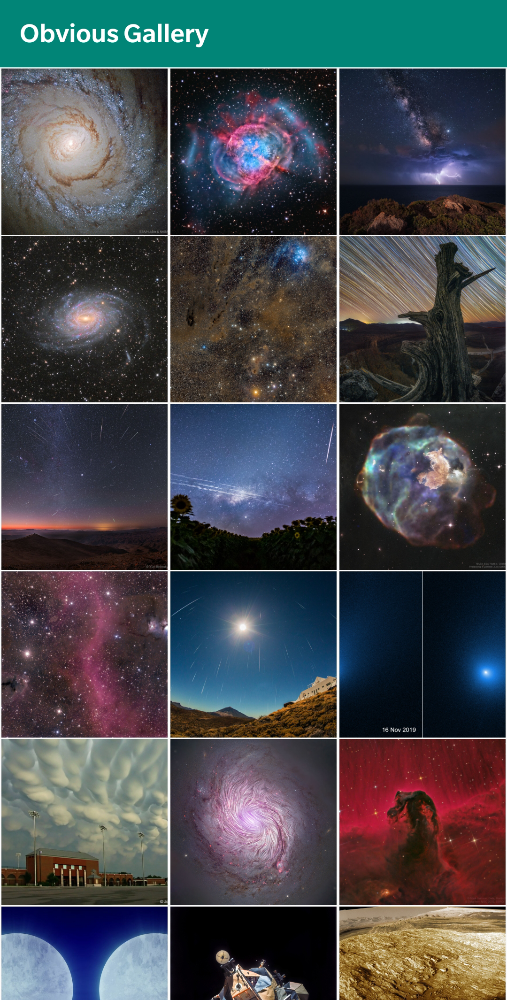
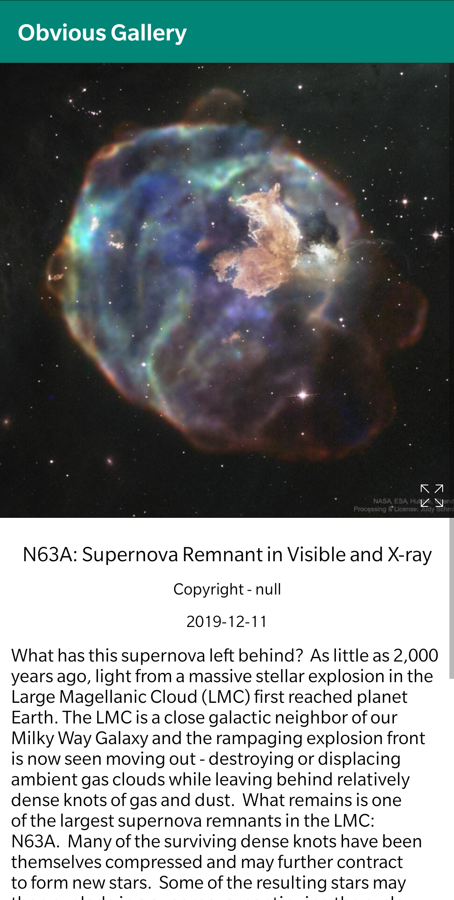
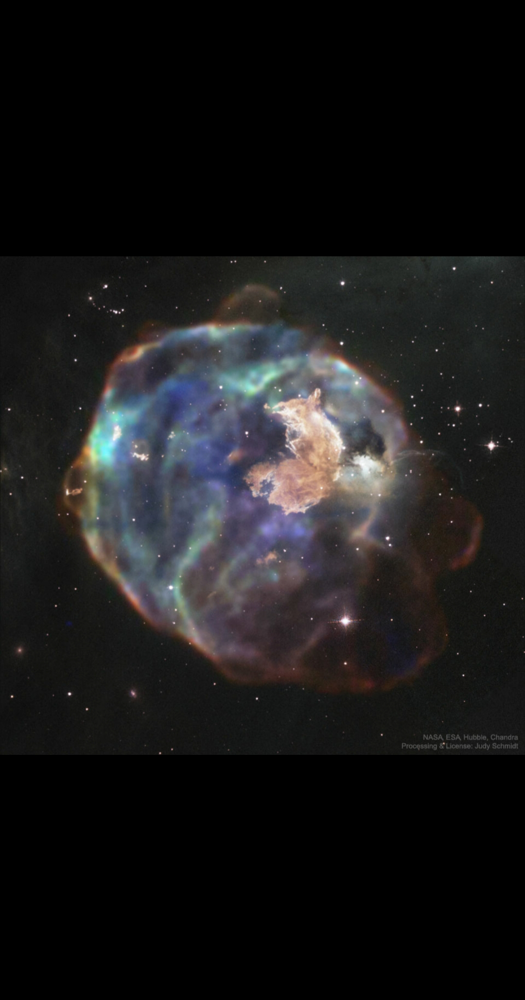

Obvious Gallery is an gallery app that shows the latest and greatest images from NASA

Main page             |  Detail page          |  Full screen page
:-------------------------:|:-------------------------:|:-------------------------:|
  |    |  

## Getting Started
### Setup
Clone or download the repo 

### Open and Run Project in Android Studio
Open the project in Android Studio and click RUN. Simple.

### Libraries
1. Glide
2. Viewpager2
3. GSON

### Android Version Targeting
Works on Lollipop and above

### Todos

 - Unit Tests
 - Add Night Mode
 - Live internet check

### License

MIT